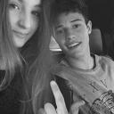

# Twitter Captioning using Show and Tell
Uses a variant of the model presented by [1] [Vinyals 2014] (http://arxiv.org/abs/1411.4555) to generate tweets that accompany pictures from Twitter.

### Model

As detailed in [1], the model extracts convolutional features and uses them as the initial input to an LSTM, with each word of the accompanying tweet as the next input in the sequence. Both the convolutional features and the one-hot word vector are projected into the LSTM's input vector.

This model uses a [Lasagne implementation of VGG-net](https://github.com/Lasagne/Recipes/blob/master/examples/styletransfer/Art%20Style%20Transfer.ipynb) [2] [Simonyan 2014](http://arxiv.org/abs/1409.1556) for feature extraction. Weights can be downloaded from:

`wget https://dl.dropboxusercontent.com/u/63070080/vgg19_normalized.pkl`

For data gathering, it's also necessary to have a Twitter developer account with API key and access token, which are saved in `private_config.py`. However, any set of images and and text can be used.

### Results

Some of the captions almost make sense:

`from details st for january snow colors`

`this boy is is my epic favorite shirt show but`

The current training set is only around 20,000 images and captions, but I hope to be training it with more data and improving the results soon!

### Dependencies
- lasagne
- theano
- fuel
- hdf5
- tqdm
